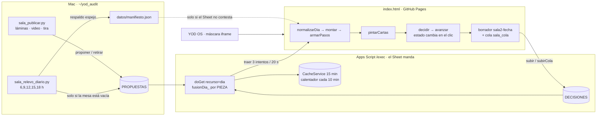

# Sala de Edición · Manual del sistema (7-sep-2026)

> Este documento es la verdad operativa de la Sala. Se lee ANTES de tocar `index.html`, `Code.gs`,
> `sala_publicar.py` o `sala_relevo_diario.py`. Si algo de aquí deja de ser cierto, se corrige aquí
> primero. Complementa a `CLAUDE.md` (reglas del repo) y a la skill `/sala` (el ciclo diario).

## 1. Qué es y quién la usa

La Sala es la mesa donde **Alejandro** y **Sayri** deciden, carta por carta, lo que la Mac produce
ese día: láminas, videos, guiones, textos de publicación. La Mac (`agente`) propone y reporta; los
editores deciden; el **Sheet manda** (Apps Script `/exec`). El portal es un solo archivo estático
(`index.html`) servido por GitHub Pages y embebido en el YOD OS.

Tres puertas: **Hoy** (las cartas), **Publicaciones** (en camino + expedientes), **Ajustes**
(mensajes a Producción y «pedir /sala»).

## 2. Cómo fluye una decisión (diagrama)



Puntos fijos de esa cadena:

| Punto | Dónde | Regla |
|---|---|---|
| Fecha del día | `hoy()` en Code.gs, TZ America/Hermosillo | nunca el reloj local de la Mac |
| Identidad | `pyod_clave_v1` (OS) o `sala_clave` | se lee viva, no se copia |
| Merge de editores | `fusionDia_` | por editor y por PIEZA: manda el sobre más reciente que la mencione; «no» manda |
| Cache | `dia:v2:<fecha>` | se invalida en cada POST; el calentador la rehace |
| Respaldo | `datos/manifiesto.json` | solo si el Sheet no contesta; se dice en pantalla y se reintenta |

## 3. Invariantes (lo que no se negocia) y por qué

1. **Ningún botón depende de un temporizador.** `avanzar()` cambia `idx` en el mismo clic; el
   anti-doble-toque es de 250 ms medido con reloj y `vigilante()` (cada 500 ms) suelta cualquier
   candado o capa huérfana. *Por qué:* dentro del OS o con la ventana tapada el navegador congela
   `setTimeout`; el candado `_decidiendo` no se soltaba y «los botones dejaban de correr».
2. **Nunca se vuelve a preguntar lo decidido.** `avanzar()` salta cartas con marca; el contador
   cuenta solo lo pendiente; tras «Cambiar» se regresa a UNA carta, no a todas.
3. **El Sheet fusiona por pieza, no por último sobre** (GAS v44). *Por qué:* cada envío nuevo
   borraba las marcas de las piezas que no traía y la mesa las volvía a pedir.
4. **Montar es idempotente** (GAS v43): misma fecha + mismo id reemplaza la fila, nunca apila.
   **Una rehecha retira a su base** (`sala_publicar.py` → `accion:retirar`). *Por qué:* el video
   apareció dos veces; la lámina vieja y la nueva salían como dos cartas.
5. **El relevo solo llena una mesa vacía** y aborta (código 3) si no pudo leer las marcas de algún
   día. *Por qué:* re-montó tres piezas del 27-ago ya decididas.
6. **Cada versión, su carpeta** (`laminas/<slug-vN>/`). El publicador se detiene si intenta
   sobreescribir una versión o si la lámina es idéntica (md5) a una versión previa. La tira lleva
   `versiones[]` con fecha y huella; la Sala muestra «Versión N · salió hoy» y el comparador.
   *Por qué:* el 3-sep la v1 se sobreescribió con la v2 y «la veía igual».
7. **La carta nunca cae bajo el pliegue.** Grid de escritorio `auto 1fr`; el panel lateral tiene
   scroll propio. En teléfono el alto de la carta se MIDE (`ajustarZona`) y la franja de versión se
   compacta si la lámina quedaría chica.
8. **Nunca un id interno en pantalla.** `tituloDe(pid)` y `numeroReal()`; las tiras de piezas
   retiradas se cargan para nombrarlas.
9. **La carta nunca llega sola** (tira completa) y **un eje se cierra con un solo sí**.
10. **Decidir es de los editores.** El agente propone, retira y reporta; nunca marca.
11. **«Pendiente» nunca borra; «borrar» es explícito** (GAS v45). Por editor, pieza y LÁMINA manda la fila
    más reciente con marca real; una copia sin marcas no puede deshacer nada. Deshacer/Cambiar/Reabrir mandan
    `borrar`. *Por qué:* un cliente que abrió una copia mandó «pendiente» y borró las marcas del día.
12. **Con sesión, la Sala nunca abre una copia.** Si el Sheet no contesta, espera (reintento cada 20 s,
    tope 60 s) con «Reintentar ahora»; jamás una mesa de respaldo donde decidir. *Por qué:* decidir sobre la
    copia produjo la falla anterior.
13. **Guardar tarda segundos, no medio minuto.** `fechaDe` memoizada (un día frío pasó de 48 s a ~6 s) y la
    cache del día se recalienta en un disparador diferido (`calentarUnaVez_`), no dentro del POST.
14. **Lo decidido hoy se queda en Mis respuestas** (láminas y ejes) para poder Reabrir; no desaparece.
15. **Las cuatro llaves se rotan en TODAS las filas de CONFIG** (v46). *Por qué:* con una fila repetida se
    escribía la última y se leía la primera → «clave incorrecta».
16. **Un id NUNCA vuelve con contenido distinto** (8-sep). Si cambian las opciones o el número de láminas,
    va id nuevo + `origen: "rehech[ao]-de <id viejo>"`; `sala_publicar.py` aborta si detecta el choque.
    *Por qué:* el eje del video se republicó con el mismo id y otras opciones; el «sí» al índice 1
    («espera la escena 3 animada») pasó a leerse como la nueva opción 1 («cambia el texto»).
17. **El comparador dice la verdad de cada versión:** una versión con otra después dice «se rehízo»; solo
    la última puede decir «en tu mesa». El publicador sella esa marca al montar.
18. **El relevo COMPLEMENTA la mesa, no la sustituye** (GAS v48). Lo pendiente de los 14 días previos se
    suma a lo montado hoy y se marca con `de_antes`; solo eso se filtra por decisión. *Por qué:* montar una
    pieza nueva en un día que venía de relevo virtual apagaba el relevo y **borraba de la mesa lo pendiente**
    (al montar el video desaparecieron las láminas 4 y 7 ya montadas).
19. **Deshacer viaja al Sheet.** La subida contempla los borrados explícitos; la píldora nunca se queda en
    «Guardando…» sin haber mandado nada.
20. **Una nota escrita no se borra con un vacío** (GAS v49 + rehidratación en el cliente). *Por qué:* la nota
    del video («que lo revise Hormozi, escena por escena…») se perdió porque los envíos siguientes mandaron
    esa fila vacía. Igual que las marcas: el vacío nunca pisa lo escrito.
21. **Una credencial rechazada se dice.** «El Sheet no reconoció tu entrada» con «Entrar otra vez», nunca
    un «Abriendo la mesa…» eterno ni un «sin señal» falso.

22. **Rotar una llave nunca deja fuera a nadie** (GAS v50-v52). Al rotar se guarda `<clave>_anterior` con su
    fecha y se acepta 72 h; quien entra con ella recibe `clave_nueva` en la respuesta —también al ESCRIBIR—
    y la Sala la guarda sola. Una segunda rotación dentro de la gracia no pisa la vigente. Acción
    `gracia_manual` (agente) para desbloquear a alguien. *Por qué:* el 7-sep roté las cuatro claves y el
    navegador de Alejandro se quedó con la vieja: «la entrada está incorrecta».
23. **Las llaves se PRUEBAN, nunca se borran.** `traer()` recorre todas las guardadas (la del OS y la de la
    Sala) y se queda con la que el Sheet acepta. *Por qué:* el primer arreglo borraba `sala_clave` dando por
    hecho que era la que había fallado, y podía perder la buena sin probarla.
24. **Nadie publica sin sellar la versión.** `SELLO_SALA` es la huella del propio archivo; `sellar_sala.py`
    lo actualiza y un hook de `pre-push` bloquea el envío si no está al día. La Sala compara su sello con el
    del servidor y ofrece recargar; el verificador comprueba que la dirección corta no sirva una Sala vieja.
    *Por qué:* GitHub Pages servía la raíz cacheada y «los arreglos no llegaban».

### Recorrido real contra el Sheet (7-sep, día aislado 2026-01-05)

| # | Acción en la Sala | Sobre que viaja | Sheet después | ✓ |
|---|---|---|---|---|
| 1 | Aprobar L1 | `si,pendiente,pendiente` | L1 si | ✓ |
| 2 | Pedir cambio L2 con nota | `si,no,pendiente` + nota | L1 si · L2 no «cambia el fondo» | ✓ |
| 3 | Deshacer | `si,borrar,pendiente` | L1 si · L2 vacía | ✓ |
| 4-5 | L2 sí · L3 sí | `si,si,si` | las tres sí | ✓ |
| 6 | Eje → B | eje `pendiente,si,pendiente` | eje B | ✓ |
| 7 | Mis respuestas → Cambiar L1 | `borrar,si,si` | L1 vacía, resto intacto | ✓ |
| 8 | Re-aprobar L1 | `si,si,si` | todo sí | ✓ |
| 9 | Copia vacía (todo pendiente) | `pendiente×3` | **nada cambió** | ✓ |
| 10-11 | Reabrir L1 → no con nota | `borrar…` luego `no…` | L1 no «ahora sí cámbiala» | ✓ |
| 12 | Reabrir eje → C | eje `pendiente,borrar,si` | eje C (B borrada) | ✓ |

Herramienta: `python3 ~/yod_audit/sala_sobre.py <fecha-aislada> '<sobre>'` (solo fechas anteriores a jun-2026).

## 4. Fallas del 7-sep: causa raíz → corrección → por qué no vuelve

| Síntoma que vio Alejandro | Causa raíz | Corrección | Candado |
|---|---|---|---|
| «Los botones ya no corren después de varias pantallas» | `_decidiendo` se soltaba en un `setTimeout(300)`; timers congelados en iframe/ventana tapada | estado en el clic; candado por reloj; `vigilante()` | invariante 1; `sala_verificar.py` lo recorre |
| «Me hablas de lo mismo / me duplicas cosas» | fusión por último sobre; `proponer` apilaba; relevo re-montó decididas; base no retirada | GAS v43/v44; retirar; relevo con guardas | invariantes 2-5 |
| «La veo igual aunque digas que es nueva» | v1 sobreescrita por v2 en la misma carpeta | v1 restaurada de git; `versiones[]`; md5 en el publicador | invariante 6 |
| Mesa «vacía» en escritorio (solo botones) | el panel alto repartía su altura entre dos filas del grid | `grid-template-rows:auto 1fr` | invariante 7 |
| «¿Qué día salió esto?» | sin fechas por versión | `fechaBonita`, comparador de versiones | invariante 6 |
| Videos con «máscara» (franjas congeladas) | montaje con la lámina fija arriba/abajo | `apodo/montar_v2.py`: clip a cuadro completo + capa de texto | regla de producción |
| Producción se detenía por cuota de GPU | un solo motor | `video_motores.py` cascada (Wan → … → LTX local) | regla de producción |

## 5. Recursos fijos (siempre los mismos, no se inventan)

| Recurso | Ruta |
|---|---|
| Portal | `~/sala-edicion/index.html` → `https://yodesarrollomx.github.io/sala-edicion/` |
| Backend | `~/sala-gas/Code.gs` (fuente) · despliegue `python3 /tmp/desplegar.py "<nota>"` (API, ~60 s) |
| Liga /exec + clave agente | `~/.sala_gas` (2 líneas, 600) · las 4 claves en `~/.sala_gas_claves.json` |
| Montar una pieza | `python3 ~/yod_audit/sala_publicar.py --pub <carpeta> --titulo … --slug <slug-vN> --origen "rehecha-de <pid>" --tira <tira.json>` |
| Retirar de la mesa | `gas_post({"accion":"retirar","fecha":…,"ids":[…],"motivo":…})` |
| Relevo | `python3 ~/yod_audit/sala_relevo_diario.py` (launchd `mx.yodesarrollo.relevo`) |
| Estado vivo | `progreso.py` → `estado_piezas.py` → `expedientes.py` (en ese orden) |
| Verificación | `python3 ~/yod_audit/sala_verificar.py` (recorrido de botones + escritorio/teléfono/máscara) |
| Motores de video | `~/yod_audit/video_motores.py` · llaves en `~/.video_motores.json` |
| Auditoría de envíos | `GET ?recurso=envios&f=<día>&clave=<agente>` |

## 6. Manual del editor (Alejandro / Sayri)

1. Entra por el YOD OS → Embudo → Sala. La credencial del OS vale.
2. **Hoy**: una carta a la vez. ← o «Pedir cambio» (con nota) · → o «Aprobar». Arriba, la tira
   completa de la pieza: verde = aprobada, oro = la de hoy, roja = con cambio. Toca cualquier lámina
   de la tira para verla, pedirle cambio o **comparar versiones** (fecha de cada una).
3. **Mis respuestas**: lo decidido hoy con «Cambiar»; lo de días anteriores con «Reabrir».
4. **Publicaciones**: dónde va cada pieza y su expediente. **Ajustes**: mensaje a Producción o
   «pedir /sala».
5. Todo se guarda en el Sheet al instante; sin red queda en cola y sube solo al volver.

## 7. Manual de operación (Mac / Claude)

- Ciclo: `/sala` = cosechar (`recurso=dia`) → reportar lo decidido → producir → montar (publicador
  con tira y versiones) → verificar (`sala_verificar.py`) → avisar.
- Antes de decir «hecho»: la tabla de `sala_verificar.py` en el chat.
- Cambios al GAS: editar `~/sala-gas/Code.gs` → `desplegar.py` → esperar 60 s → probar con un GET
  fresco (`&fresco=1`).
- Si el cliente parece «trabado»: abrir consola y ver `vigilante` (existe), `CAPAS.length`,
  `_decidiendo`, `document.hidden`. Con la ventana tapada las capturas salen congeladas: verificar
  por DOM.

25. **Una lámina que ya vio no se le vuelve a preguntar** (8-sep). El publicador anota en
    `datos/laminas_vistas.json` la huella de cada lámina que se mandó a decidir; `regla_no_repetir_lo_visto`
    bloquea montar una imagen idéntica como carta (de contexto en la tira sí, como carta nunca).
    *Por qué:* `apodo-g3` llegó con 9 láminas y solo 2 eran nuevas — las otras 7 eran byte por byte
    las de g1 y g2. Su reclamo: «me pones cosas que ya habíamos modificado».
26. **Al teléfono nunca le viaja un PNG** (8-sep). Cada lámina se guarda dos veces: `Ln.png` (obra,
    ~1.3 MB, solo al Ampliar) y `Ln.jpg` (~120 KB, lo que se pinta). *Por qué:* 73 de 142 láminas no
    tenían ligera y su teléfono bajaba 1.3 MB por carta: 153 MB contra 17 MB.

27. **Cada lámina tiene un serial que no cambia nunca** (8-sep). `APODO-L04` nace con la lámina;
    la revisión `r1…rN` sube SÓLO cuando la huella cambia. Copiar una carpeta no es una revisión.
    → `sala_catalogo.py`, pestaña `CATALOGO`, `recurso=catalogo`. *Por qué:* la misma queja se
    repitió cinco veces porque una lámina no tenía identidad. Ver `docs/LA-LEY.md`.
28. **Las imágenes viven en Drive; el Sheet sólo lleva letras** (8-sep). `YOD Editorial/<PIEZA>/
    <SERIAL>/` con dos archivos por revisión: `-original.png` (maestro limpio, es lo que se
    publica) y `-prueba.jpg` (ligera y SELLADA con el serial, es lo que se revisa). Una prueba
    nunca se publica. Medido: Drive 1.7 s · jpg del repo 2.1 s · PNG del repo 6.8 s.

29. **El número de lámina lo dice la TIRA, no el nombre del archivo** (8-sep). Una carpeta
    montada trae sólo las rehechas: `laminas/apodo-g5/L2.png` es la lámina **3**. El `mapa` de la
    tira (posición → lámina real) manda sobre el nombre. *Por qué:* al derivar el serial del
    nombre se corrompieron 8 seriales — la rehecha de la lámina 9 acabó como `APODO-L06` y las
    cinco versiones de la lámina 4 de El Comprador quedaron apiladas en `COMPRADOR-L01`.
30. **Una pieza bloqueada no deja rastro** (8-sep). Si la guardia o el catálogo detienen el
    montaje, `_deshacer()` borra las láminas copiadas y revierte el manifiesto. *Por qué:*
    `empujar()` hace `git add -A` y la basura de una pieza rechazada viajaba en el push siguiente.

31. **El video se JUNTA sólo con todas las láminas aprobadas** (8-sep). Animar una escena suelta
    se puede si esa lámina ya está aprobada; **juntar el corte con una lámina abierta, no**.
    → `sala_compuerta.py`, exigido desde `apodo/montar_v2.py`. *Por qué, textual:* «luego andas
    cambiando videos completos porque aún no terminabas de aprobar todas las láminas… así es como
    estás deteriorando el sistema». Corolario: **un eje de video no va a la mesa mientras haya
    láminas abiertas** — preguntarle antes de tiempo es lo que produce el retrabajo.

32. **Las marcas del Sheet nunca se tiran** (9-sep). Al montar una pieza nueva la firma del
    borrador dejaba de cuadrar, `restaurarBorrador` salía con `false`, y `armarPasos` —con
    `borradorManda`— ya había puesto `prev=null`. Resultado: **lo recién aprobado volvía a la
    mesa como pendiente**, con el «sí» sano en el Sheet Y en el borrador. Ahora las marcas se
    fusionan siempre (van por pid e índice); sólo el «dónde ibas» depende de la firma.
    *Ésta es la causa de la queja que se repitió seis veces.*
33. **Un eje con `opciones.candidatas` conserva sus opciones** (9-sep). El cliente las movía a
    `p.candidatas` —que nadie lee— y dejaba `opciones=[]`, así que el filtro de más abajo
    descartaba la pieza por vacía: el corte llegó al Sheet y **nunca apareció en la mesa**.

34. **Nunca un `until ! pgrep -f X` en el shell** (9-sep). `pgrep -f` encuentra al PROPIO bucle
    que espera, porque el patrón está en su línea de comando: el bucle se ve a sí mismo y no sale
    jamás. Llegaron a haber **seis esperas vivas al mismo tiempo**, una de 4 h 42 min, todas
    esperando lo mismo. Se usa `esperar.py`. Ojo: el primer intento NO servia — el candado usaba `hash()` de Python
    (aleatorio por proceso) y el filtro usaba `pgrep -af`, que en macOS no devuelve la linea
    de comando. Van TRES trampas en el mismo lugar; estan en la memoria esperas-colgadas. *Reclamo textual: «¿qué rayos llevas esperando
    horas?… ¿estás duplicando esfuerzos? no sé si eres consciente de lo que haces».*

## Dónde vive cada cosa (y qué NO usamos)

| Cosa | Dónde | Peso típico |
|---|---|---|
| La decisión (marca + nota) | fila de texto en el Sheet | 0.4–2 KB |
| El día entero que pide la Sala | respuesta del Apps Script | ~28 KB |
| La lámina que ve en pantalla | `laminas/<slug>/Ln.jpg` en GitHub Pages | ~120 KB |
| La lámina de obra (Ampliar, publicar) | `laminas/<slug>/Ln.png` | ~1.3 MB |
| El guion / la tira / la dirección | `datos/tiras/<pid>.json` | ~4 KB |

**Corrección del 8-sep (más abajo en el día):** Drive SÍ participa ahora, y es el archivo
maestro — una carpeta por lámina, un archivo por revisión, con el serial en el nombre. Lo que
sigue siendo cierto es que **el Sheet nunca guarda imágenes**, sólo la ruta y el id de Drive. Si guardar o traer se siente lento, no es el peso de las fotos: es el Apps Script
(por eso la cache `dia:v2` y el calentador diferido).

## 8. El proceso vive en el código, no en este documento

Pregunta de Alejandro (8-sep): «¿se puede que el proceso de edición viva en el código y no en tu
sistema md o lo que sea?». Sí, y es la dirección del sistema. Este documento explica el **porqué**;
lo que **impide** que las reglas se rompan es código que bloquea:

| Regla | Dónde vive ahora | Qué pasa si se rompe |
|---|---|---|
| Cero cifras de dinero, nada de «gratis», sin plazos ni garantías | `sala_guardia.py` | el montaje se detiene |
| Áreas en m², nunca m³ | `sala_guardia.py` | el montaje se detiene |
| Una rehecha nunca llega sola (tira completa) | `sala_guardia.py` | el montaje se detiene |
| Cada versión su carpeta; nunca sobrescribir | `sala_guardia.py` + `sala_publicar.py` | el montaje se detiene |
| Un id nunca vuelve con otro contenido | `sala_publicar.py` | el montaje se detiene |
| Una publicación ya salida no vuelve a la mesa | `sala_guardia.py` + `sala_relevo_diario.py` | el montaje se detiene / el relevo la retira |
| Nadie publica la Sala sin sellar la versión | hook `pre-push` + `sala_guardia.py` | el envío se rechaza |
| Lámina idéntica a una versión previa | `sala_publicar.py` | el montaje se detiene |
| Rotar llaves no deja fuera a nadie | `Code.gs` (gracia + renovación) | no aplica: es automático |
| «Pendiente» no borra; el vacío no pisa lo escrito | `Code.gs` (fusión por lámina) | no aplica: es automático |

Lo que sigue viviendo en prosa —y por tanto sigue dependiendo de que se lea— es el criterio:
qué hace buena a una lámina, cómo se atiende una nota, cuándo una pieza está lista. Eso es juicio,
no regla. La frontera es esa: **si se puede comprobar, va en `sala_guardia.py`; si hay que
juzgarlo, va aquí**. Añadir una regla nueva es añadir una función `regla_*` a la guardia: se
descubren solas y cada una lleva al lado la fecha en que costó caro.

## 9-sep-2026 · cuatro cosas que estaban rotas de raíz

**35. El tamaño de la letra manda; el texto se acomoda.** (`tipografia.py`)
El generador encogía la letra hasta que el texto cupiera en dos renglones: el CTA del Apodo
salió a 46 px contra 77 px del resto, y Alejandro lo marcó como «las láminas quedaron mal los
textos». Ahora la letra tiene piso (66 px) y se usan hasta tres renglones antes de tocarla; si
ni así cabe, el generador lo AVISA para que un editor acorte el texto — no lo decide el código.
El mismo error estaba escrito dos veces (make_lamina2.py y apodo/montar_v6.py); por eso ahora
vive en un solo archivo.

**36. Lo que se PUBLICA pasa por la guardia igual que lo que se ve en la Sala.**
Las 15 reglas miraban el título y la tira. El caption que va a Facebook e Instagram no lo
miraba nadie: el del Apodo llevaba una palabra vetada desde el día anterior y dos escenas que
él acababa de mandar retirar. Regla nueva `caption_sin_escena_retirada`, y `_textos()` ahora
incluye `yod_post_<pieza>.json`.

**37. Una sola puerta al Sheet, y de verdad.** (`gas.py`)
Dos fallas encadenadas:
 · `-X POST` junto con `-L` obliga a curl a repetir POST en el redirect de Google hacia
   googleusercontent, que sólo acepta GET → 405 y una página de «No se encontró la página».
   Ése era el «404 intermitente»: parecía intermitente porque a veces Google contesta 200 sin
   redirect. Se quitó el `-X`.
 · `gas.py` se llamaba «la puerta única» y sólo la usaban tres archivos. Los otros doce
   hablaban al /exec con urllib por su cuenta — incluido el verificador, que por eso daba el
   día en rojo. Hoy pasan todos por ahí. `gas.leer/escribir` aceptan `rol=` para quien
   necesita la llave de editor.

**38. `retirar` no bastaba: `armarDia_` no filtraba las retiradas de HOY.** (GAS v57)
El GAS marcaba estado='retirada' y contestaba `retiradas: 2`, pero la lectura del día sólo
descartaba las retiradas de días previos. Montar una versión rehecha el mismo día dejaba la
vieja Y la nueva en la mesa: el duplicado que más le molesta, con un «ok» de por medio.

**Y una trampa de método:** `sala_relevo_diario.py` tiene todo su cuerpo a nivel de módulo.
Importarlo para mirar una función corre el relevo completo. Ya lleva guarda de import.

## 10-sep-2026 · el silencio que sonaba a nada

**39. Un filtro con entrada en loop puede detenerse ANTES de lo pedido — sin avisar.**
`sidechaincompress` con su señal principal en `-stream_loop -1` cortaba entre 1 y 5 segundos
antes de la duración pedida con `-t`. El corte del Apodo v7 salió con **los últimos 2 segundos
en silencio digital total** (-120 dBFS, no un fundido) porque el fondo se apagaba de golpe y
lo único que quedaba ahí (la voz) también estaba en silencio en ese tramo.

Se midió, no se adivinó: aislar cada etapa del filtro (fondo solo, fondo con ducking, mezcla
final) hasta encontrar en cuál exactamente aparecía el corte a cero.

**La cura, reusable en cualquier mezcla de audio de la Sala:** renderizar con MARGEN de sobra
más allá de lo que hace falta, materializar a un archivo real, y RECIÉN ENTONCES recortar a
la duración exacta. El faltante se come el margen, nunca el contenido real. El montador ahora
mide la duración real de lo que generó y truena si ni con margen alcanzó — nunca sirve silencio
donde debería sonar algo.

**40. La compuerta puede decir «sí» sin haber comprobado nada.** Cuando una pieza ya se aprobó
por completo, el Sheet la retira de la mesa del día siguiente — con razón, ya no hay nada que
decidir. Pero `estado_laminas` devolvía `{}` para esa pieza (no la encontraba en la mesa de
hoy), y una lista de faltantes VACÍA se leía como «todo aprobado»: un sí por accidente, no por
verificación. Pasó el 10-sep con `apodo-g7-c7faea` — resultó ser cierto, pero no porque se
hubiera comprobado. Ahora, si la pieza no está en la mesa, se busca su tira más reciente y se
leen sus marcas en `decisiones.propuestas` (que el Sheet conserva con `heredada`); y si de
plano no se encuentra ninguna pieza, la compuerta dice NO en vez de decir sí por defecto.

## 12-sep-2026 · cuatro fallas más, encontradas al atender su rechazo del video

**41. Retocar una lámina YA texteada podía dejar un fantasma del texto viejo.** (`retipo.py`)
Cuando el texto NUEVO usa menos renglones que el viejo, el degradado se volvía opaco más
abajo que antes —dependía de cuántos renglones trajera el texto de HOY— y un resto del texto
anterior, justo arriba de la zona opaca, se colaba a medio pintar. Se vio en vivo al acortar
la lámina 3 (de 3 a 2 renglones): «También le dicen» fantasma sobre el texto nuevo. Ahora la
franja se vuelve opaca a una distancia FIJA de su borde superior, sin importar el texto de hoy.

**42. `tipografia._repartir` no partía de verdad en más de 3 renglones.** Pedir 4 ó 5 renglones
daba exactamente el mismo resultado que pedir 3 — el código para n>3 estaba escrito igual al
de n=3. Se generalizó con combinaciones de cortes: funciona para cualquier n razonable (los
textos de una lámina son cortos). Lo destapó el CTA de la 6, que sólo cupo a tamaño completo
usando 4 renglones.

**43. La compuerta podía confundir las 3 marcas de un EJE con 6 marcas de LÁMINA.**
El respaldo del 10-sep (invariante 40) buscaba la tira más reciente de la familia cuando la
pieza no estaba en la mesa — pero si la tira más reciente resultaba ser la de un EJE DE VIDEO
(3 opciones, `decidir: []`, sólo de contexto), sus 3 marcas de «qué opción elegiste» se leían
como si fueran 6 marcas de «qué lámina aprobaste»: sus tres «no» se convirtieron en «láminas
1, 2 y 3 sin aprobar», bloqueando animar la lámina 1 que en realidad SÍ estaba aprobada. Ahora
el respaldo exige `decidir` no vacío y que el número de marcas cuadre exacto con el número de
láminas de esa tira; si no, sigue buscando en la tira anterior.

**44. Una regla de estilo no se le aplica a SUS PROPIAS PALABRAS.** `nota_previa` en una tira
es su frase, citada tal cual para que el editor recuerde por qué se rehizo una lámina — no es
copy que el sistema escribe. La regla «Personalizado con P mayúscula» la disparaba contra su
propia nota («…su plan de potencial personalizado…», dictada en minúsculas). Corregirle la
cita para que pasara la regla habría sido ponerle palabras en la boca; se excluyó `nota_previa`
de las reglas de estilo de copy — se sigue mostrando igual en la Sala.

## 12-sep-2026 (tarde) · el contador mentía después de usar «Ir»

**45. El contador de «Faltan N decisiones» sólo miraba desde donde estaba parado, no toda la mesa.**
`irA(k)` —el botón «Ir» de «Mis respuestas», hecho a propósito para saltar a cualquier tarjeta
pendiente sin decidir las de en medio— mueve `idx` directo a `k`. Pero el contador calculaba
`pasos.filter((x,k)=>k>=idx&&...)`: sólo contaba lo que quedaba DESDE `idx` hacia adelante.
Saltar a la última lámina pendiente (índice 3 de 4) hizo que «Faltan 3 decisiones» se convirtiera
en «Falta 1 decisión» de golpe, sin que se hubiera decidido nada — verificado contra el Sheet:
cero marcas guardadas. `cuentas()` (el contador de aprobadas/con cambios) ya lo hacía bien, contando
todo `pasos` sin filtrar por `idx`; el contador de arriba no seguía la misma regla. Ahora sí.

## Simulacro (12-sep-2026): probar las invariantes sin tocar el día vivo

`sala_simulacro.py` es la versión repetible del «Recorrido real contra el Sheet» de la sección 3:
un solo comando corre 12 casos contra un DÍA AISLADO (nunca el vivo — `assert fecha < 2026-06-01`,
igual que `sala_sobre.py`), imprime ✓/✗ con un dato medido por caso, y al terminar retira del Sheet
todo lo que él mismo montó.

```
python3 ~/yod_audit/sala_simulacro.py                    # usa el día de prueba por defecto (2026-05-20)
python3 ~/yod_audit/sala_simulacro.py --fecha 2026-04-10  # otro día aislado
```

Qué cubre cada caso: (1) proponer la misma pieza dos veces no duplica la fila; (2) retirar la saca
de la mesa; (3) dos editores en conflicto — el «no» manda, con las dos firmas; (4) reabrir una
lámina ya aprobada con nota; (5) un envío «todo pendiente» nunca borra una marca real anterior;
(6) un eje decidido no se vuelve a preguntar aunque se retire de la mesa; (7) `sala_publicar.py`
aborta si el mismo id llega con contenido distinto (md5), probado en una carpeta temporal, sin
llegar al GAS; (8) `gas.py` distingue un error de RED (puerto que no contesta) de un error QUE
CONTESTA EL SHEET (`{"error": "..."}` desde un servidor de prueba local); (9) `voces_v7.py`
descarta un audio sintético más largo que el tope y vuelve a pedirlo, sin llamar a Gemini; (10)
`sala_compuerta.puede_juntar` nunca da «sí» por accidente ni con `pid=None` ni con una lámina
sin aprobar, usando un día simulado (`monkeypatch` de `sala_compuerta._dia`); (11) `tipografia.ajustar`
acomoda un texto corto sin avisar y AVISA cuando un texto no cabe ni al piso; (12) confirma que
`montar_v7.py` trae el chequeo que truena si el fondo de audio sale más corto que el corte (sin
generar video).

Sale con código 0 sólo si los 12 casos dieron ✓. Si algo falla, la tabla final dice exactamente
cuál — nunca «pasó en general».

## 12-sep-2026 (tarde) · el plan «de raíz»: COLA, REGLAS, MOTORES y el productor

Hasta hoy la producción era una fila india: lámina → «sí» → animar → voz → corte → «sí». Una
lámina sin decidir detenía todo lo demás, y cuando el editor por fin decidía, alguien tenía que
acordarse de qué seguía. Alejandro lo pidió al revés: *que cada etapa tenga varios prospectos
corriendo solos y que lo aprobado en una rama dispare la siguiente sin esperar a las demás*, y
*todo configurable en Sheets, nada hardcodeado* (`docs/PLAN-RAIZ.md`).

**46. Los números de producción viven en la hoja REGLAS, no en el código.** Columnas
`nombre · valor · descripcion`. `sala_reglas.regla(nombre, default)` los lee; si el Sheet no
contesta usa el caché y, si tampoco hay, el default de fábrica — pero deja escrito en `ORIGEN`
de dónde salió cada valor, para que ningún reporte pueda decir «esto lo puso Alejandro» cuando
en realidad es el default. Las 15 reglas sembradas: los tres de tipografía, `cabecera_px`, los
cuatro de audio, los tres del candado de duración de voz, `prospectos_por_rechazo`, y los tres
del productor (`productor_cada_min`, `productor_silencio_desde/hasta`).

**47. La cascada de motores vive en la hoja MOTORES.** Columnas
`etapa · motor · encendido · tope_dia · costo · orden · nota`. Apagar `ltx_local` o encender
`minimax` es cambiar un 1 por un 0 en el Sheet: no se toca código ni se redespliega nada.
`sala_reglas.motores(etapa)` devuelve sólo los encendidos, ya ordenados por `orden`. Un
`tope_dia` > 0 se cuenta contra los trabajos de esa etapa que hoy quedaron en `hecho` o
`corriendo` en la COLA — un trabajo empezado ya gastó la cuota aunque no haya terminado.

**48. Un trabajo es una fila de COLA, y su `id` es su identidad: `pieza:etapa:item:version`.**
`version` es el md5 del INSUMO — la lámina para una escena, el texto del guion para una voz —,
nunca un consecutivo. De ahí salen las dos propiedades que importan: correr el productor diez
veces seguidas no repite nada (ese id ya está `hecho`), y cuando una lámina se rehace su md5
cambia, el id cambia, y la salida vieja queda detectada como obsoleta sola. Así se supo hoy,
sin lista a mano, que `E6.mp4` del Apodo ya no sirve: su lámina 6 se rehizo en g8.
Estados: `pendiente → corriendo → hecho | fallo`, con `evidencia` (md5 de la salida, segundos,
motor, código de salida) en la misma fila y una línea en BITÁCORA por la acción `produccion`,
que ya existía — no hace falta republicar el GAS para dejar rastro.

**49. `accion:'hojas'` es idempotente y NUNCA devuelve nada a los valores de fábrica.** Crea
REGLAS, MOTORES y COLA si faltan, y de las filas por defecto agrega sólo las que no estén (por
`nombre` en REGLAS, por `etapa+motor` en MOTORES). Alejandro edita esos números a mano: correrlo
dos veces no puede pisarle un cambio ni duplicarle un renglón. `accion:'cola'` acepta
`op:'upsert'` (crea o reemplaza por id, conservando el `creado` original) y `op:'estado'`, que
sólo mueve estado/motor/evidencia de una fila que YA existe — nunca inventa un trabajo.

**50. Las columnas `id` e `item` de COLA están forzadas a texto.** Mordida en vivo hoy: el item
de una candidata es `3-1` y la hoja lo guardó como la fecha 1-mar-2026. Con eso el productor no
reconocía sus propias candidatas y las volvía a encolar en cada pasada. `accion:'hojas'`
reaplica `setNumberFormat('@')` a esas dos columnas cada vez que corre.

**51. La compuerta se abre RAMA POR RAMA, no «todo o nada».** `sala_productor.planear()` lee el
estado real de cada lámina con `sala_compuerta` (que es quien sabe leerlo del Sheet, con sus dos
bugs ya corregidos del 10 y el 12-sep) y, por cada lámina:
`si` → abre su escena y su voz aunque sus hermanas sigan abiertas; `no` → abre
`prospectos_por_rechazo` candidatas, y sólo si no existen ya candidatas para ESA lámina en ESA
versión; `pendiente` → no hace nada, porque eso le toca al editor. El corte sigue siendo la única
compuerta de todo-o-nada: `puede_juntar` (todas aprobadas) **y** escena y voz vigentes de todas.

**52. Sin evidencia previa, la fecha del archivo es la única prueba — y para las voces no
sirve.** La primera vez que corre el productor la COLA está vacía y hay productos en disco de
antes. Para una escena, la prueba es que el `.mp4` sea más nuevo que su `.png`. Para una voz no:
el guion es UN archivo con TODAS las escenas, así que editar la 6 lo «envejece» para las seis y
mandaría a regrabar cuatro voces buenas. La tira sí lo dice lámina por lámina: la marcada
`rehecha` cambió de texto, la `aprobada` se arrastró igual. Ese es el criterio de arranque.

**53. Nunca dos productores a la vez: candado de archivo con md5, jamás `hash()`.** El candado
(`~/yod_audit/sala/productor.lock`) guarda pid + `hashlib.md5` del propio comando. `hash()` de
Python es aleatorio entre procesos: un candado así no cierra nada. Tampoco se usa `pgrep -f`,
que se encuentra a sí mismo. Si el archivo quedó de un proceso muerto (la Mac se durmió a media
corrida) se detecta con `os.kill(pid, 0)` y se recupera; y al soltarlo sólo se borra el propio,
nunca el de otro. `--simular` no toma candado a propósito: no debe estorbarle a uno real.

**54. El productor ENCOLA; ejecutar cuesta y lo enciende Alejandro desde el Sheet.** La regla
`productor_ejecuta_etapas` (vacía de fábrica) lista qué etapas corre de verdad. Vacía, el
productor abre las compuertas, escribe la COLA y reporta, sin gastar los 17 minutos de Mac que
cuesta una escena. Encolar no destruye nada; por eso el estado de fábrica es el seguro.
El horario quieto (`productor_silencio_desde/hasta`, 23→7) sí lo respeta siempre, y cruza la
medianoche bien.

**55. `mx.yodesarrollo.productor` corre `--una-vez` cada 1200 s** (= `productor_cada_min` × 60),
log en `~/yod_audit/sala/productor.log`. Ese 1200 está **congelado en el plist**: cambiar la
regla en el Sheet NO lo mueve, hay que reescribir el plist entero y `bootout` + `bootstrap`
(nunca `sed` sobre un plist cargado). Y como siempre: no cuenta como instalado hasta que el log
existe — el de hoy apareció a las 13:43 con su corrida completa.

## 12-sep-2026 (noche) · el run del plan de raíz — lo que cambió además de lo de los agentes

**56. Una opción de eje puede traer imagen.** `opciones.candidatas[].src` se pinta en la carta;
así un «no» produce 2–3 candidatas de LÁMINA y él elige, en vez de una sola rehecha a ciegas.
Hoy: `apodo-g9-l3` (2 tomas) y `apodo-g9-l5` (2 tomas) a partir de la nota de Sayri.

**57. Las reglas se editan sin abrir el Sheet.** `accion=regla {set:{nombre:valor}}` (solo agente,
`rolDe(d.clave)`; el primer intento usaba una variable `rol` que en `doPost` no existe y rechazaba
a todos). Con eso se encendió `productor_ejecuta_etapas = escena,voz` desde código, no a mano.

**58. Un timeout de Gemini también se reintenta.** La voz 6 falló dos veces con «read operation
timed out» y `voces_v7` sólo reintentaba `HTTPError`; ahora cubre `URLError`/`TimeoutError`.

**59. El eje del 28-ago se volvía a preguntar.** `ganchos-casos` se decidió (opción 4) y nunca se
retiró; el relevo lo traía cada día y hoy Sayri lo volvió a contestar. Retirado con motivo: el
caso 4 se publicó el 2-sep. Regla: un eje cumplido se retira en el mismo run que lo cumple.

**Pendiente honesto del run:** el productor todavía corre los scripts POR PIEZA (animar/voces
enteros, idempotentes por escena), no por ítem; `prospectos` no tiene generador automático
(hoy se hicieron a mano con recetas mflux); el intervalo del launchd no lee la regla; el espejo
público `gas/Code.gs` sigue atrasado.

## Árbol de producción (12-sep-2026, pestaña «Producción»)

Reclamo textual de Alejandro: «quiero ver en tiempo real dónde va cada cosa cuando se está
trabajando… como árbol de posibilidades… algo más fácil de llevar». Cuarta puerta, junto a
Hoy · Publicaciones · Ajustes.

**Qué lee** (`pintarProduccion()` en `index.html`, solo lectura, nunca decide nada):

| Fuente | Para qué |
|---|---|
| `GAS()+'?recurso=cola&clave='+CLAVE()` | Filas de la fábrica: `{id,pieza,etapa,item,motor,estado,prioridad,bloqueado_por,evidencia,pidio,creado,actualizado}`. Etapas: `prospectos` (rama Guion) · `escena` (Escenas) · `voz` (Voces) · `corte` (Corte). |
| `datos/tiras/index.json` + `datos/tiras/<pid>.json` | La rama Láminas: cada `l` con `n`, `src`, `version`, `estado` (`aprobada`/`rehecha`/pendiente) y, si trae `candidatas:[{src,titulo,texto}]`, una sub-hoja por candidata. |
| `datos/piezas.json` (ya cargado por `cargarExpedientes` en `PZ`) | La rama Publicada cuando `PZ[pieza].estado==='publicada'`. |

Las piezas del árbol son la unión de: claves de `PZ`, el campo `pieza` de cada fila de la cola, y
`tira.pieza` de cada tira cargada (`nombresDePiezas()`). Sin esa unión una pieza que sólo vive en
la cola (aún sin tira) o sólo en la tira (aún sin fila en cola) no aparecería.

**Cómo se pinta:** un `.prod-pieza` por pieza, con «va en `<etapa>`» arriba y una línea fija
**«Qué falta»** (`quefaltaPara()`) derivada así, en orden:
1. Si hay una lámina de la tira con `estado!=='aprobada'` → *«esperando tu sí en la lámina N»*.
2. Si no, si hay un ítem de `escena`/`voz`/`corte` sin `hecho` en su estado → *«la fábrica está en
   `<item>`»*.
3. Si todo lo anterior está limpio y la pieza está publicada → *«ya está publicada»*; si hay corte
   sin pendientes → *«corte en tu mesa»*; si no hay nada aún → *«esperando la fábrica»*.

Debajo, una rama por etapa (`ramaEtapaCola` para Guion/Escenas/Voces/Corte, `ramaLaminas` para
Láminas) con una «hoja» por ítem: punto de color + miniatura (si hay `src`) + texto corto; el
`title` del elemento lleva la evidencia completa (motor, hora, `bloqueado_por`) para tocar/pasar
el cursor, tal como pide la entrega.

**Qué significa cada color** (`colorPunto()` para la cola; para láminas es directo):
- **Verde** — hecho / aprobada / listo.
- **Oro** — corriendo, o «en tu mesa» (una lámina rehecha esperando tu sí).
- **Gris** — pendiente, aún no empieza.
- **Rojo** — falló.

**Si `recurso=cola` no contesta** (`COLA_ERR=true`): el árbol se arma igual, solo con las tiras
(rama Láminas) y las ramas de cola quedan vacías; arriba se lee «Sin la hoja COLA · mostrando
solo las tiras». Nunca pantalla negra — invariante nueva, misma familia que la 12 (nunca una mesa
de respaldo silenciosa).

**Se refresca sola cada 60 s** (`setInterval(...,60000)`, solo relee datos, invariante 1: ningún
botón depende de un temporizador) y con el botón «Actualizar» (`#prodActualizar`).

**Móvil:** una columna (`@media (max-width:640px){ .prod-hojas{flex-direction:column} }`), sin
desborde horizontal (`max-width:100%` en `.prod-pieza`/`.prod-hoja`, imágenes ya acotadas por la
regla global `img{max-width:100%}`).

### Candidatas de lámina en la carta de «Hoy» (Entrega B)

Si la lámina de la tira que se está decidiendo trae `candidatas:[{src,titulo,texto}]`, se pintan
DENTRO de la carta (`.cand-fila`, entre el lienzo y el pie) como una fila de miniaturas con botón
«Ésta» por candidata. Elegir una hace exactamente lo mismo que Aprobar esa lámina: marca
`dec[pid].laminas[i]='si'`, escribe `[toma elegida: k]` en `dec[pid].notas[i]` y llama a
`avanzar('si')` — mismo camino que usan hoy «Aprobar»/«Pedir cambio», así que viaja al Sheet con
el mismo sobre. Sin `candidatas`, la carta queda exactamente como antes.

Nota: esto es distinto de las candidatas de un **eje** (`p.opciones[].src`, ya existían desde el
12-sep de la madrugada — invariante 56, arriba): ahí la opción vive en la propuesta completa; aquí
vive dentro de una lámina concreta de la tira, y sólo se ve mientras esa lámina está en tu mesa.
