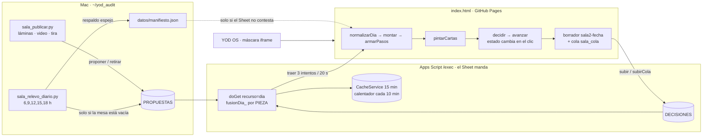

# Sala de Edición · Manual del sistema (7-sep-2026)

> Este documento es la verdad operativa de la Sala. Se lee ANTES de tocar `index.html`, `Code.gs`,
> `sala_publicar.py` o `sala_relevo_diario.py`. Si algo de aquí deja de ser cierto, se corrige aquí
> primero. Complementa a `CLAUDE.md` (reglas del repo) y a la skill `/sala` (el ciclo diario).

## 1. Qué es y quién la usa

La Sala es la mesa donde **Alejandro** y **Sayri** deciden, carta por carta, lo que la Mac produce
ese día: láminas, videos, guiones, textos de publicación. La Mac (`agente`) propone y reporta; los
editores deciden; el **Sheet manda** (Apps Script `/exec`). El portal es un solo archivo estático
(`index.html`) servido por GitHub Pages y embebido en el YOD OS.

Tres puertas: **Hoy** (las cartas), **Publicaciones** (en camino + expedientes), **Ajustes**
(mensajes a Producción y «pedir /sala»).

## 2. Cómo fluye una decisión (diagrama)

Puntos fijos de esa cadena:

| Punto | Dónde | Regla |
|---|---|---|
| Fecha del día | `hoy()` en Code.gs, TZ America/Hermosillo | nunca el reloj local de la Mac |
| Identidad | `pyod_clave_v1` (OS) o `sala_clave` | se lee viva, no se copia |
| Merge de editores | `fusionDia_` | por editor y por PIEZA: manda el sobre más reciente que la mencione; «no» manda |
| Cache | `dia:v2:<fecha>` | se invalida en cada POST; el calentador la rehace |
| Respaldo | `datos/manifiesto.json` | solo si el Sheet no contesta; se dice en pantalla y se reintenta |

## 3. Invariantes (lo que no se negocia) y por qué

1. **Ningún botón depende de un temporizador.** `avanzar()` cambia `idx` en el mismo clic; el
   anti-doble-toque es de 250 ms medido con reloj y `vigilante()` (cada 500 ms) suelta cualquier
   candado o capa huérfana. *Por qué:* dentro del OS o con la ventana tapada el navegador congela
   `setTimeout`; el candado `_decidiendo` no se soltaba y «los botones dejaban de correr».
2. **Nunca se vuelve a preguntar lo decidido.** `avanzar()` salta cartas con marca; el contador
   cuenta solo lo pendiente; tras «Cambiar» se regresa a UNA carta, no a todas.
3. **El Sheet fusiona por pieza, no por último sobre** (GAS v44). *Por qué:* cada envío nuevo
   borraba las marcas de las piezas que no traía y la mesa las volvía a pedir.
4. **Montar es idempotente** (GAS v43): misma fecha + mismo id reemplaza la fila, nunca apila.
   **Una rehecha retira a su base** (`sala_publicar.py` → `accion:retirar`). *Por qué:* el video
   apareció dos veces; la lámina vieja y la nueva salían como dos cartas.
5. **El relevo solo llena una mesa vacía** y aborta (código 3) si no pudo leer las marcas de algún
   día. *Por qué:* re-montó tres piezas del 27-ago ya decididas.
6. **Cada versión, su carpeta** (`laminas/<slug-vN>/`). El publicador se detiene si intenta
   sobreescribir una versión o si la lámina es idéntica (md5) a una versión previa. La tira lleva
   `versiones[]` con fecha y huella; la Sala muestra «Versión N · salió hoy» y el comparador.
   *Por qué:* el 3-sep la v1 se sobreescribió con la v2 y «la veía igual».
7. **La carta nunca cae bajo el pliegue.** Grid de escritorio `auto 1fr`; el panel lateral tiene
   scroll propio. En teléfono el alto de la carta se MIDE (`ajustarZona`) y la franja de versión se
   compacta si la lámina quedaría chica.
8. **Nunca un id interno en pantalla.** `tituloDe(pid)` y `numeroReal()`; las tiras de piezas
   retiradas se cargan para nombrarlas.
9. **La carta nunca llega sola** (tira completa) y **un eje se cierra con un solo sí**.
10. **Decidir es de los editores.** El agente propone, retira y reporta; nunca marca.
11. **«Pendiente» nunca borra; «borrar» es explícito** (GAS v45). Por editor, pieza y LÁMINA manda la fila
    más reciente con marca real; una copia sin marcas no puede deshacer nada. Deshacer/Cambiar/Reabrir mandan
    `borrar`. *Por qué:* un cliente que abrió una copia mandó «pendiente» y borró las marcas del día.
12. **Con sesión, la Sala nunca abre una copia.** Si el Sheet no contesta, espera (reintento cada 20 s,
    tope 60 s) con «Reintentar ahora»; jamás una mesa de respaldo donde decidir. *Por qué:* decidir sobre la
    copia produjo la falla anterior.
13. **Guardar tarda segundos, no medio minuto.** `fechaDe` memoizada (un día frío pasó de 48 s a ~6 s) y la
    cache del día se recalienta en un disparador diferido (`calentarUnaVez_`), no dentro del POST.
14. **Lo decidido hoy se queda en Mis respuestas** (láminas y ejes) para poder Reabrir; no desaparece.
15. **Las cuatro llaves se rotan en TODAS las filas de CONFIG** (v46). *Por qué:* con una fila repetida se
    escribía la última y se leía la primera → «clave incorrecta».
16. **Un id NUNCA vuelve con contenido distinto** (8-sep). Si cambian las opciones o el número de láminas,
    va id nuevo + `origen: "rehech[ao]-de <id viejo>"`; `sala_publicar.py` aborta si detecta el choque.
    *Por qué:* el eje del video se republicó con el mismo id y otras opciones; el «sí» al índice 1
    («espera la escena 3 animada») pasó a leerse como la nueva opción 1 («cambia el texto»).
17. **El comparador dice la verdad de cada versión:** una versión con otra después dice «se rehízo»; solo
    la última puede decir «en tu mesa». El publicador sella esa marca al montar.
18. **El relevo COMPLEMENTA la mesa, no la sustituye** (GAS v48). Lo pendiente de los 14 días previos se
    suma a lo montado hoy y se marca con `de_antes`; solo eso se filtra por decisión. *Por qué:* montar una
    pieza nueva en un día que venía de relevo virtual apagaba el relevo y **borraba de la mesa lo pendiente**
    (al montar el video desaparecieron las láminas 4 y 7 ya montadas).
19. **Deshacer viaja al Sheet.** La subida contempla los borrados explícitos; la píldora nunca se queda en
    «Guardando…» sin haber mandado nada.
20. **Una nota escrita no se borra con un vacío** (GAS v49 + rehidratación en el cliente). *Por qué:* la nota
    del video («que lo revise Hormozi, escena por escena…») se perdió porque los envíos siguientes mandaron
    esa fila vacía. Igual que las marcas: el vacío nunca pisa lo escrito.
21. **Una credencial rechazada se dice.** «El Sheet no reconoció tu entrada» con «Entrar otra vez», nunca
    un «Abriendo la mesa…» eterno ni un «sin señal» falso.

22. **Rotar una llave nunca deja fuera a nadie** (GAS v50-v52). Al rotar se guarda `<clave>_anterior` con su
    fecha y se acepta 72 h; quien entra con ella recibe `clave_nueva` en la respuesta —también al ESCRIBIR—
    y la Sala la guarda sola. Una segunda rotación dentro de la gracia no pisa la vigente. Acción
    `gracia_manual` (agente) para desbloquear a alguien. *Por qué:* el 7-sep roté las cuatro claves y el
    navegador de Alejandro se quedó con la vieja: «la entrada está incorrecta».
23. **Las llaves se PRUEBAN, nunca se borran.** `traer()` recorre todas las guardadas (la del OS y la de la
    Sala) y se queda con la que el Sheet acepta. *Por qué:* el primer arreglo borraba `sala_clave` dando por
    hecho que era la que había fallado, y podía perder la buena sin probarla.
24. **Nadie publica sin sellar la versión.** `SELLO_SALA` es la huella del propio archivo; `sellar_sala.py`
    lo actualiza y un hook de `pre-push` bloquea el envío si no está al día. La Sala compara su sello con el
    del servidor y ofrece recargar; el verificador comprueba que la dirección corta no sirva una Sala vieja.
    *Por qué:* GitHub Pages servía la raíz cacheada y «los arreglos no llegaban».

### Recorrido real contra el Sheet (7-sep, día aislado 2026-01-05)

| # | Acción en la Sala | Sobre que viaja | Sheet después | ✓ |
|---|---|---|---|---|
| 1 | Aprobar L1 | `si,pendiente,pendiente` | L1 si | ✓ |
| 2 | Pedir cambio L2 con nota | `si,no,pendiente` + nota | L1 si · L2 no «cambia el fondo» | ✓ |
| 3 | Deshacer | `si,borrar,pendiente` | L1 si · L2 vacía | ✓ |
| 4-5 | L2 sí · L3 sí | `si,si,si` | las tres sí | ✓ |
| 6 | Eje → B | eje `pendiente,si,pendiente` | eje B | ✓ |
| 7 | Mis respuestas → Cambiar L1 | `borrar,si,si` | L1 vacía, resto intacto | ✓ |
| 8 | Re-aprobar L1 | `si,si,si` | todo sí | ✓ |
| 9 | Copia vacía (todo pendiente) | `pendiente×3` | **nada cambió** | ✓ |
| 10-11 | Reabrir L1 → no con nota | `borrar…` luego `no…` | L1 no «ahora sí cámbiala» | ✓ |
| 12 | Reabrir eje → C | eje `pendiente,borrar,si` | eje C (B borrada) | ✓ |

Herramienta: `python3 ~/yod_audit/sala_sobre.py <fecha-aislada> '<sobre>'` (solo fechas anteriores a jun-2026).

## 4. Fallas del 7-sep: causa raíz → corrección → por qué no vuelve

| Síntoma que vio Alejandro | Causa raíz | Corrección | Candado |
|---|---|---|---|
| «Los botones ya no corren después de varias pantallas» | `_decidiendo` se soltaba en un `setTimeout(300)`; timers congelados en iframe/ventana tapada | estado en el clic; candado por reloj; `vigilante()` | invariante 1; `sala_verificar.py` lo recorre |
| «Me hablas de lo mismo / me duplicas cosas» | fusión por último sobre; `proponer` apilaba; relevo re-montó decididas; base no retirada | GAS v43/v44; retirar; relevo con guardas | invariantes 2-5 |
| «La veo igual aunque digas que es nueva» | v1 sobreescrita por v2 en la misma carpeta | v1 restaurada de git; `versiones[]`; md5 en el publicador | invariante 6 |
| Mesa «vacía» en escritorio (solo botones) | el panel alto repartía su altura entre dos filas del grid | `grid-template-rows:auto 1fr` | invariante 7 |
| «¿Qué día salió esto?» | sin fechas por versión | `fechaBonita`, comparador de versiones | invariante 6 |
| Videos con «máscara» (franjas congeladas) | montaje con la lámina fija arriba/abajo | `apodo/montar_v2.py`: clip a cuadro completo + capa de texto | regla de producción |
| Producción se detenía por cuota de GPU | un solo motor | `video_motores.py` cascada (Wan → … → LTX local) | regla de producción |

## 5. Recursos fijos (siempre los mismos, no se inventan)

| Recurso | Ruta |
|---|---|
| Portal | `~/sala-edicion/index.html` → `https://yodesarrollomx.github.io/sala-edicion/` |
| Backend | `~/sala-gas/Code.gs` (fuente) · despliegue `python3 /tmp/desplegar.py "<nota>"` (API, ~60 s) |
| Liga /exec + clave agente | `~/.sala_gas` (2 líneas, 600) · las 4 claves en `~/.sala_gas_claves.json` |
| Montar una pieza | `python3 ~/yod_audit/sala_publicar.py --pub <carpeta> --titulo … --slug <slug-vN> --origen "rehecha-de <pid>" --tira <tira.json>` |
| Retirar de la mesa | `gas_post({"accion":"retirar","fecha":…,"ids":[…],"motivo":…})` |
| Relevo | `python3 ~/yod_audit/sala_relevo_diario.py` (launchd `mx.yodesarrollo.relevo`) |
| Estado vivo | `progreso.py` → `estado_piezas.py` → `expedientes.py` (en ese orden) |
| Verificación | `python3 ~/yod_audit/sala_verificar.py` (recorrido de botones + escritorio/teléfono/máscara) |
| Motores de video | `~/yod_audit/video_motores.py` · llaves en `~/.video_motores.json` |
| Auditoría de envíos | `GET ?recurso=envios&f=<día>&clave=<agente>` |

## 6. Manual del editor (Alejandro / Sayri)

1. Entra por el YOD OS → Embudo → Sala. La credencial del OS vale.
2. **Hoy**: una carta a la vez. ← o «Pedir cambio» (con nota) · → o «Aprobar». Arriba, la tira
   completa de la pieza: verde = aprobada, oro = la de hoy, roja = con cambio. Toca cualquier lámina
   de la tira para verla, pedirle cambio o **comparar versiones** (fecha de cada una).
3. **Mis respuestas**: lo decidido hoy con «Cambiar»; lo de días anteriores con «Reabrir».
4. **Publicaciones**: dónde va cada pieza y su expediente. **Ajustes**: mensaje a Producción o
   «pedir /sala».
5. Todo se guarda en el Sheet al instante; sin red queda en cola y sube solo al volver.

## 7. Manual de operación (Mac / Claude)

- Ciclo: `/sala` = cosechar (`recurso=dia`) → reportar lo decidido → producir → montar (publicador
  con tira y versiones) → verificar (`sala_verificar.py`) → avisar.
- Antes de decir «hecho»: la tabla de `sala_verificar.py` en el chat.
- Cambios al GAS: editar `~/sala-gas/Code.gs` → `desplegar.py` → esperar 60 s → probar con un GET
  fresco (`&fresco=1`).
- Si el cliente parece «trabado»: abrir consola y ver `vigilante` (existe), `CAPAS.length`,
  `_decidiendo`, `document.hidden`. Con la ventana tapada las capturas salen congeladas: verificar
  por DOM.

## 8. El proceso vive en el código, no en este documento

Pregunta de Alejandro (8-sep): «¿se puede que el proceso de edición viva en el código y no en tu
sistema md o lo que sea?». Sí, y es la dirección del sistema. Este documento explica el **porqué**;
lo que **impide** que las reglas se rompan es código que bloquea:

| Regla | Dónde vive ahora | Qué pasa si se rompe |
|---|---|---|
| Cero cifras de dinero, nada de «gratis», sin plazos ni garantías | `sala_guardia.py` | el montaje se detiene |
| Áreas en m², nunca m³ | `sala_guardia.py` | el montaje se detiene |
| Una rehecha nunca llega sola (tira completa) | `sala_guardia.py` | el montaje se detiene |
| Cada versión su carpeta; nunca sobrescribir | `sala_guardia.py` + `sala_publicar.py` | el montaje se detiene |
| Un id nunca vuelve con otro contenido | `sala_publicar.py` | el montaje se detiene |
| Una publicación ya salida no vuelve a la mesa | `sala_guardia.py` + `sala_relevo_diario.py` | el montaje se detiene / el relevo la retira |
| Nadie publica la Sala sin sellar la versión | hook `pre-push` + `sala_guardia.py` | el envío se rechaza |
| Lámina idéntica a una versión previa | `sala_publicar.py` | el montaje se detiene |
| Rotar llaves no deja fuera a nadie | `Code.gs` (gracia + renovación) | no aplica: es automático |
| «Pendiente» no borra; el vacío no pisa lo escrito | `Code.gs` (fusión por lámina) | no aplica: es automático |

Lo que sigue viviendo en prosa —y por tanto sigue dependiendo de que se lea— es el criterio:
qué hace buena a una lámina, cómo se atiende una nota, cuándo una pieza está lista. Eso es juicio,
no regla. La frontera es esa: **si se puede comprobar, va en `sala_guardia.py`; si hay que
juzgarlo, va aquí**. Añadir una regla nueva es añadir una función `regla_*` a la guardia: se
descubren solas y cada una lleva al lado la fecha en que costó caro.
